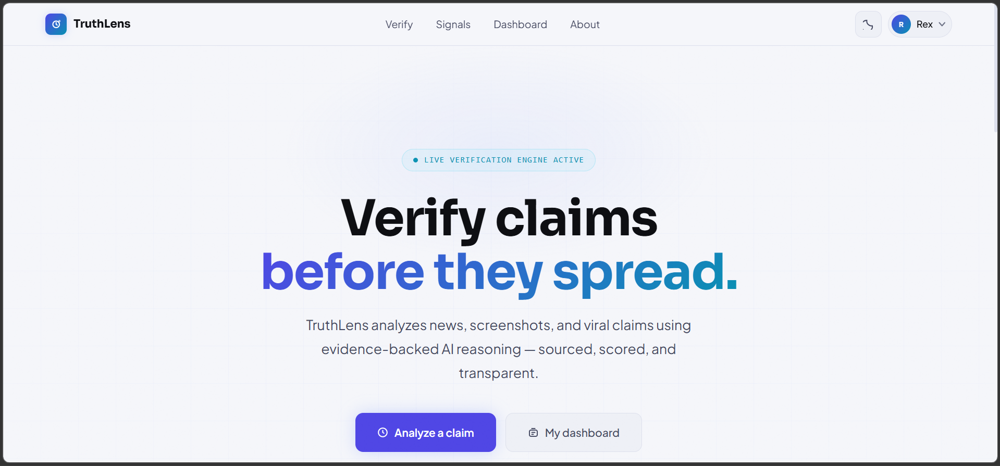
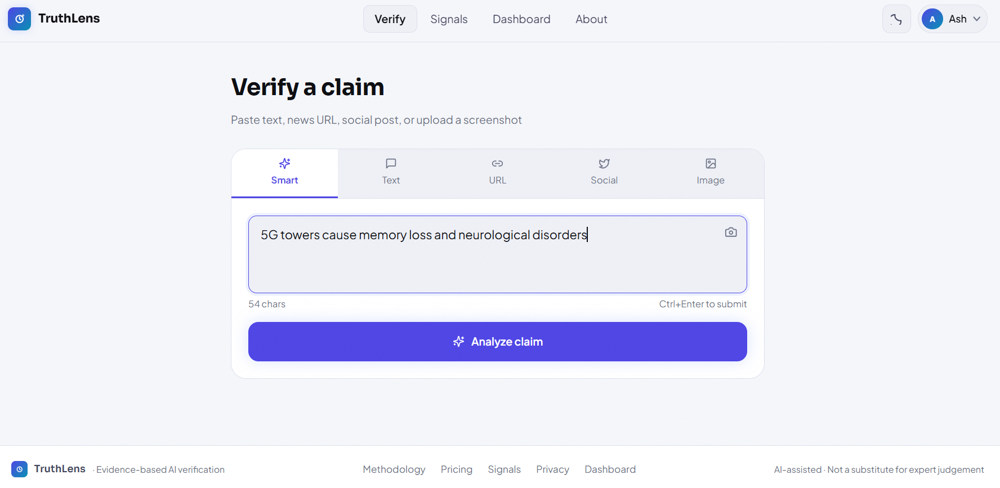
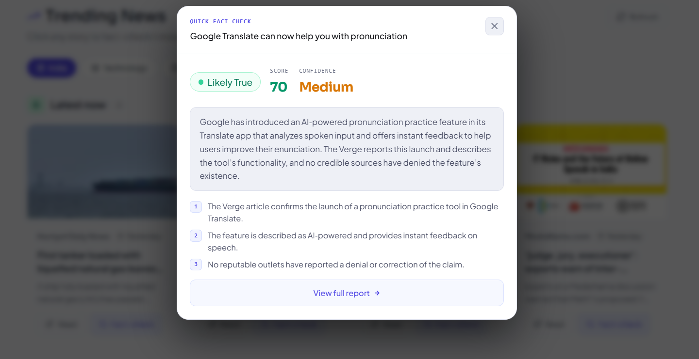
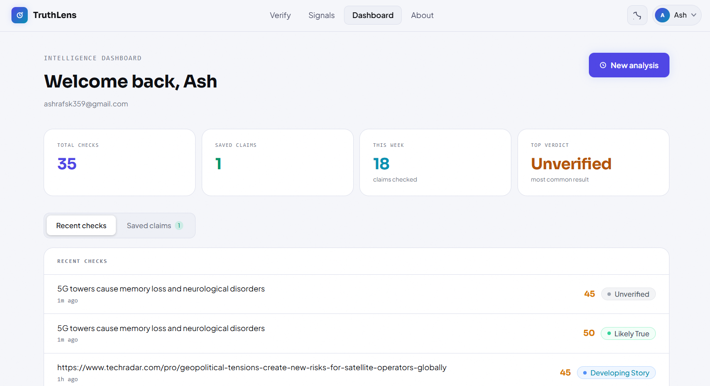
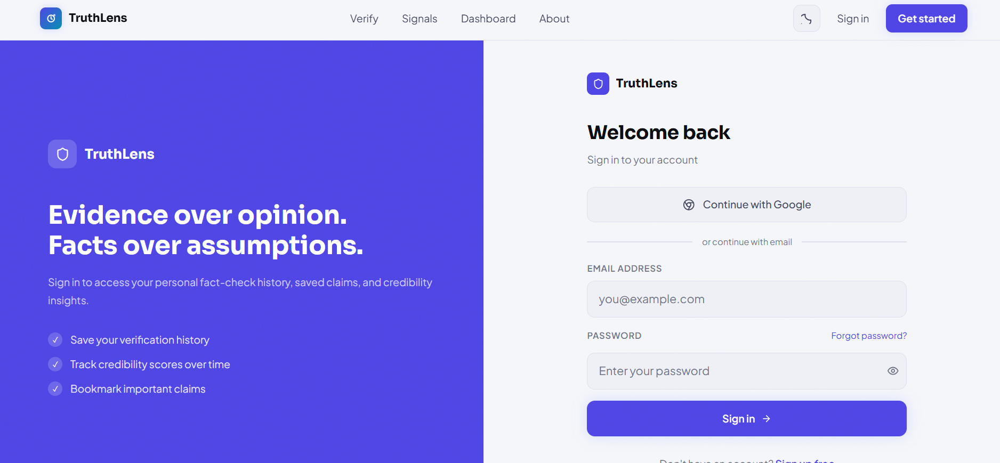
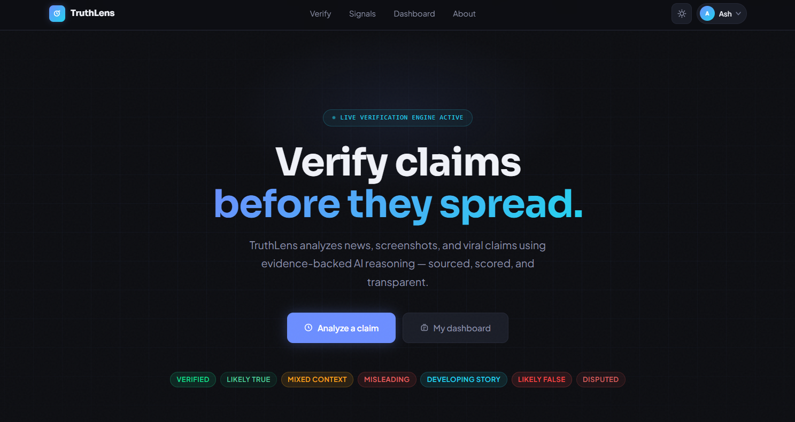
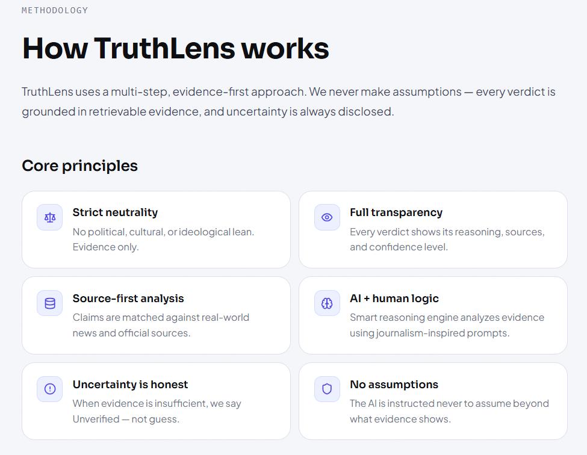

# TruthLens

TruthLens is an AI-powered fact-checking platform built to help users quickly verify online claims, headlines, URLs, and trending stories through structured analysis and evidence-based reasoning.

It was designed as a practical response to the growing spread of misinformation, while also serving as a modern full-stack project built with production-ready tools.

**Live Demo:** https://YOUR-LIVE-LINK.vercel.app

---

## Why TruthLens?

False or misleading information can spread faster than corrections. TruthLens gives users a simple way to pause, verify, and make better decisions before trusting or sharing content.

---

## Homepage Experience

The landing page is designed to feel clean, trustworthy, and easy to use from the first interaction.



---

## Core Verification Engine

Users can submit claims or statements and receive:

- Verdict classification  
- Credibility score  
- AI-generated reasoning summary  
- Supporting or conflicting evidence signals



---

## Quick Fact Check

For faster checks, users can instantly verify trending headlines directly from the Signals page without manually copying content.



---

## Signals Feed

TruthLens includes a live signals page that surfaces current stories and topics users may want to investigate quickly.


---

## User Dashboard

Authenticated users can access a personal dashboard to review saved checks, previous activity, and usage history.



---

## Authentication

Secure sign-in is supported through email and Google authentication.



---

## Dark Mode Experience

The platform includes a polished dark theme for comfortable usage across devices and environments.



---

## About & Transparency

An About page explains the purpose of the platform and how the verification workflow is approached.



---

## How It Works

1. User submits a claim, URL, or topic  
2. Relevant evidence signals are retrieved  
3. AI evaluates consistency, context, and contradictions  
4. TruthLens returns a structured result with score and verdict

---

## Technology Stack

| Layer | Tools |
|------|------|
| Frontend | Next.js 14, TypeScript |
| Styling | Tailwind CSS |
| Backend | Next.js API Routes |
| Database | Supabase |
| Authentication | Supabase Auth |
| AI Integration | OpenRouter API |
| Deployment | Vercel |

---

## Local Setup

```bash
git clone https://github.com/YOUR-USERNAME/truthlens.git
cd truthlens
npm install
npm run dev
